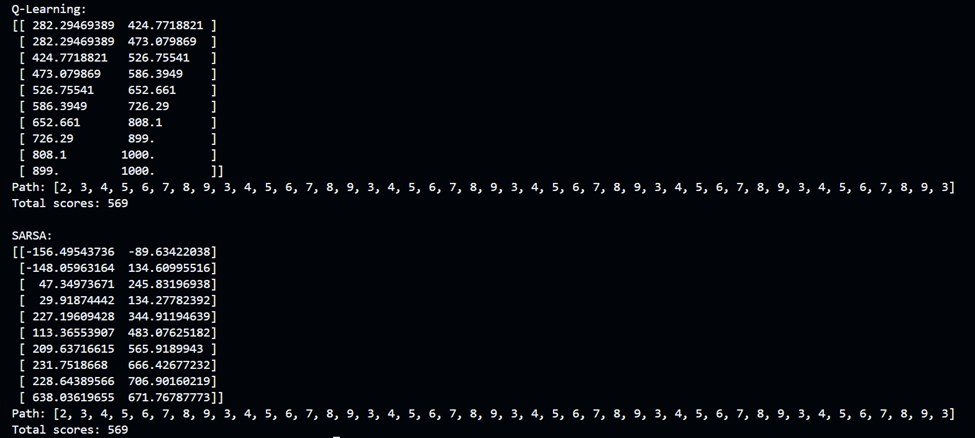

# SELEKSI_GAIB_BAGIAN4
> Seleksi Asisten Lab GaIB ‘22 Bagian 4 (Reinforcement Learning)

## Table of Contents
* [General Info](#general-information)
* [Technologies Used](#technologies-used)
* [Setup](#setup)
* [Usage](#usage)
* [Features](#features)
* [Screenshots](#screenshots)

## General Information
Reinforcement learning is a type of machine learning where an agent takes actions in an environment and then receives rewards or penalties based on the actions taken. The ultimate goal of this interaction is to make the agent behave in such a way that it maximizes the rewards received. There is a simple game with the following rules:
- There is a 1-dimensional board (movement is only left or right) consisting of 10 squares.
- There is a hole at position 0 and an apple at position 9.
- The player starts at position 2 and can move left or right.
- If the player falls into the hole, the points received are -100; if the player gets the apple, the points received are +100. If the player occupies any other position, the player receives -1 point.
- If the player falls into the hole or gets the apple, the player returns to position 3.
- The player wins when they accumulate +500 points.
- The player loses when they accumulate -200 points.

## Technologies Used
- Python 3
- NumPy

## Setup
Make sure your Python 3 version is appropriate. try running `python3 --version`, if not found, it means your Python 3 installation is not correct.  You can install it from [here](https://www.python.org/downloads/).

Clone this project
```
git clone https://github.com/FrancescoMichael/SELEKSI_GAIB_BAGIAN4.git
```

## Usage
To run this project, from root project folder, run this command: 
```
pip install numpy
python3 src/main.py
```

## Features
✅ Q-LEARNING  
✅ SARSA 

## Screenshots
<br/><br/><br/>